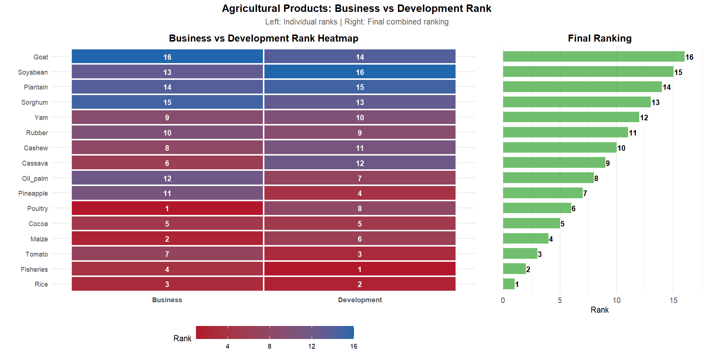

# **PPVC Value Chain Ranking – Data Visualisation & Graphics Project**

This repository contains the **data visualisation, graphics design, and copyediting work** I produced for the **PPVC Value Chain Ranking Report**, a research assignment completed for **[ANAPRI](https://www.anapri.net/)** under the **[The Policy Prioritization through Value Chain Analysis (PPVC) ](https://www.anapri.net/programmes-and-projects/ppvc/)**.

PPVC is funded by the **[Gates Foundation](https://www.gatesfoundation.org/)**, and the analytical research for this work was carried out by the **[Institute of Statistical, Social and Economic Research (ISSER)](https://isser.ug.edu.gh/), Ghana**.
My role involved:

* Data cleaning and preparation for visual outputs
* Designing charts, infographics, and visual narratives
* Ensuring consistency with report styling and design guidelines
* Copyediting and enhancing clarity of insights
* Producing final, publication-ready PNG graphics

The data used here is **non-confidential**.

---

## **1. Overview**

This repository documents the workflow and visual outputs used to support value chain prioritisation under the PPVC project.
The analysis focuses on comparing agricultural value chains across multiple metrics including:

* Scalability
* Natural resource use
* Production volatility
* Poverty impact
* Diet and nutrition contribution
* Business development indicators
* Final ranking composites

All visualisations were produced using **[R](https://www.r-project.org/)**, primarily with:

* **[dplyr](https://dplyr.tidyverse.org/)**
* **[ggplot2](https://ggplot2.tidyverse.org/)**
* **[fmsb](https://cran.r-project.org/web/packages/fmsb/index.html)**
* **[tidyr](https://tidyr.tidyverse.org/)**
* **[GGally](https://www.rdocumentation.org/packages/GGally/)**
* **[patchwork](https://patchwork.data-imaginist.com/)**

---

## **2. Repository Structure**

```

/data           # Non-confidential datasets
/plots          # PNG charts and graphics
/reports        # Optional R Markdown / Quarto rendered outputs / PDF report
/scripts        # All R scripts used to generate 
README.md
```

---

## **3. Key Visualisations**

*A high-level comparison of all value chains across three core PPVC indicators.*


---


---


---


---


---


---


---


---


---


---


---


---


---


---


---


---


---


---


---


---


---


---


---


---


---


---


---


---


---


---


---


---

## **4. Methodology Summary**

A simplified structure of the steps behind the outputs:

1. **Data Import & Cleaning**

   * Normalising column names
   * Handling missing or inconsistent entries
   * Creating derived indicators

2. **Metric Preparation**

   * Standardising values
   * Re-scaling for radar charts
   * Constructing composite scores

3. **Visualisation Design**

   * Applying consistent colour schemes
   * Enhancing readability for report publication
   * Using a minimalist, professional design style

4. **Export & Formatting**

   * All charts exported as high-resolution PNGs
   * Designed for embedding in professional reports

This process ensured that the final graphics were both analytically sound and visually compelling.

---

## **5. Other Tools Used**

* **[R (RStudio)](https://posit.co/download/rstudio-desktop/)**
* **[tidyverse](https://tidyverse.org/)**
---

## **6. Credits & Acknowledgements**

* **[ANAPRI](https://anapri.net/)** – Project Client
* **[Institute of Statistical, Social and Economic Research (ISSER)](https://isser.ug.edu.gh/), Ghana** – Lead Research Institution
* **[Gates Foundation](https://www.gatesfoundation.org/)** – Project Funder
* **Clifford Hepplethwaite** – Data visualisation, graphics design, copyediting

---

## **7. Contact**

For data visualisation, analytics, or report design work:

**Clifford Hepplethwaite**<br/>

Email: *clifford@tumpetech.com*<br/>
Website: [www.tumpetech.com](https://tumpetech.com/)<br/>
X (Twitter): [x.com/CHepplethwaite](https://x.com/CHepplethwaite)<br/>
LinkedIn: [Clifford Hepplethwaite](https://www.linkedin.com/in/clifford-hepplethwaite-2b5204348/) 


---
